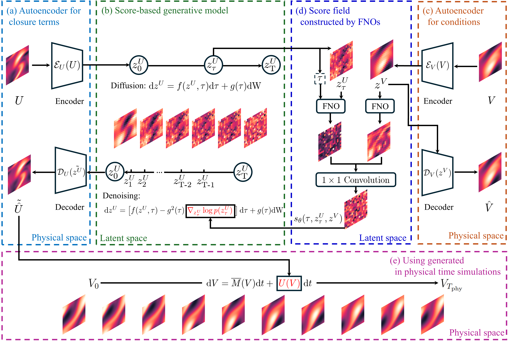

# Latent Diffusion Closures

Official implementation of the paper ["Stochastic and Non-local Closure Modeling for Nonlinear Dynamical Systems via Latent Score-based Generative Models"](https://doi.org/10.1016/j.jcp.2026.115082).

Xinghao Dong, Huchen Yang, and Jin-Long Wu

---

## Overview

This repository implements the controlled Missing Physics benchmark for learning the unresolved nonlinear term in a two-dimensional stochastic vorticity equation. It includes P-CDM, conventional two-phase L-CDM, and Joint L-CDM training and evaluation, pretrained checkpoints, and a numerical-simulation demo.



*Latent conditional diffusion framework for stochastic closure modeling (Figure 1 of the paper).*

### Highlights

- **Efficient latent sampling:** Compressing high-dimensional closure and state fields reduces conditional diffusion sampling cost, while conventional two-phase training can compromise closure-generation accuracy.
- **Joint training:** End-to-end optimization aligns autoencoder reconstruction with score matching, improving generative accuracy while retaining latent-space efficiency.
- **Fast ensemble simulation:** Coupling latent diffusion closures with numerical solvers accelerates ensemble simulation and uncertainty quantification while maintaining accuracy comparable to physical-space diffusion closures.

This release focuses on the Missing Physics case. The Appendix E LES study follows the same workflow, but its data and checkpoints are not included; other datasets may require data-loader and hyperparameter adjustments.

## Repository Structure

```text
Data/
  Data_Generation/             Missing Physics data simulator
Scripts/
  missing_physics/             Training, encoding, and evaluation entry points
  models/                      Autoencoder and conditional score-based model
  solvers/                     Vorticity rollout solver
  sampling.py                  Reverse-SDE sampler
  training.py                  Shared score-model training loop
  utils.py                     Runtime and metric utilities
Trained_Models/
  AE/Missing_Physics/          Autoencoder checkpoints
  DM/Missing_Physics/          Diffusion-model checkpoints
project_paths.py               Repository-relative path configuration
running_demo.ipynb             P-CDM and Joint L-CDM simulation demo
```

## Setup

Clone the repository, retrieve the Git LFS checkpoints, and install the Python dependencies:

```bash
git clone https://github.com/AIMS-Madison/Latent_Diffusion_Closures.git
cd Latent_Diffusion_Closures
git lfs pull
python -m venv .venv
# Windows PowerShell: .venv\Scripts\Activate.ps1
pip install -r requirements.txt
```

CUDA is recommended for training and for the full notebook simulation. Every command also accepts `--device cpu` or another PyTorch device string.

## Data

The full datasets used in the paper are available from the authors upon reasonable request. The controlled Missing Physics datasets can also be generated with the included scripts:

```bash
python -m Data.Data_Generation.generate_missing_physics --device cuda
```

## Training

Run all commands from the repository root.

### P-CDM

```bash
python -m Scripts.missing_physics.train_pcdm --device cuda
```

### Conventional L-CDM

```bash
python -m Scripts.missing_physics.train_autoencoder --field nonlinear --device cuda
python -m Scripts.missing_physics.train_autoencoder --field vorticity --device cuda
python -m Scripts.missing_physics.encode_latent_data --device cuda
python -m Scripts.missing_physics.train_conventional_lcdm --device cuda
```

### Joint L-CDM

```bash
python -m Scripts.missing_physics.train_joint_lcdm --device cuda
```

## Evaluation

Evaluate a supplied or newly trained checkpoint without creating plots or tables:

```bash
python -m Scripts.missing_physics.evaluate --method pcdm --device cuda
python -m Scripts.missing_physics.evaluate --method joint-lcdm --device cuda
python -m Scripts.missing_physics.evaluate --method conventional-lcdm --device cuda
```

## Running Demo

Open [running_demo.ipynb](running_demo.ipynb) from the repository root and execute the cells in order. The notebook loads the supplied Missing Physics checkpoints, runs P-CDM and Joint L-CDM rollouts, and reports Figure 7-style vorticity fields, Table 5-style ensemble-mean relative errors, and Figure 10-style energy spectra. Results should be compared at the level of error magnitude and qualitative behavior rather than exact numerical values.

## Citation

```bibtex
@article{dong2026stochastic,
  title   = {Stochastic and Non-local Closure Modeling for Nonlinear Dynamical Systems via Latent Score-based Generative Models},
  author  = {Dong, Xinghao and Yang, Huchen and Wu, Jin-Long},
  journal = {Journal of Computational Physics},
  volume  = {563},
  pages   = {115082},
  year    = {2026},
  doi     = {10.1016/j.jcp.2026.115082}
}
```
